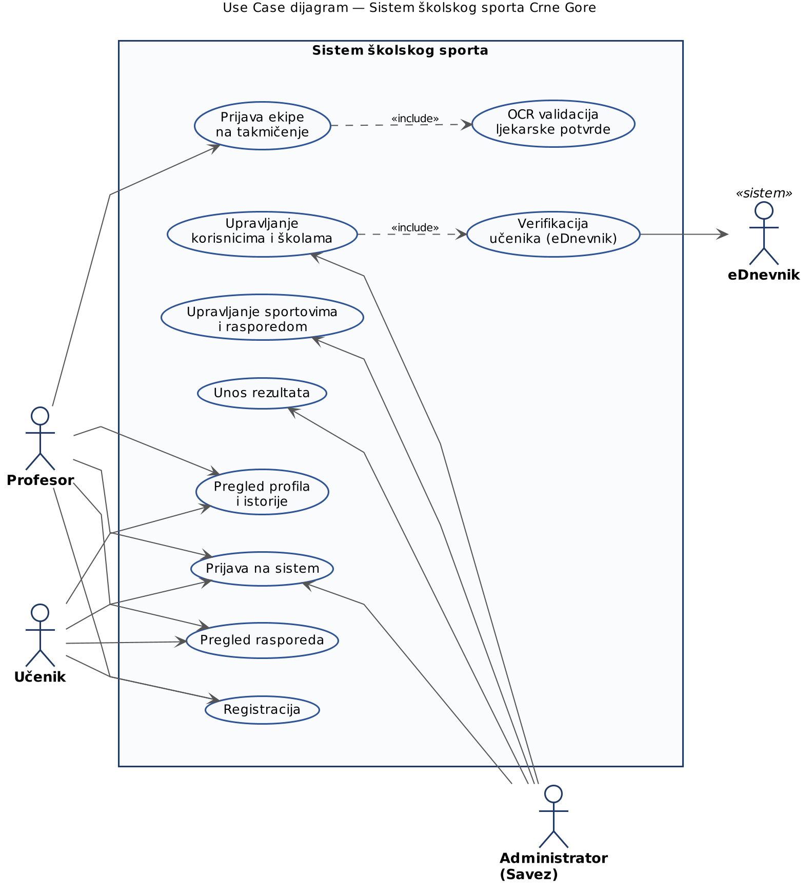
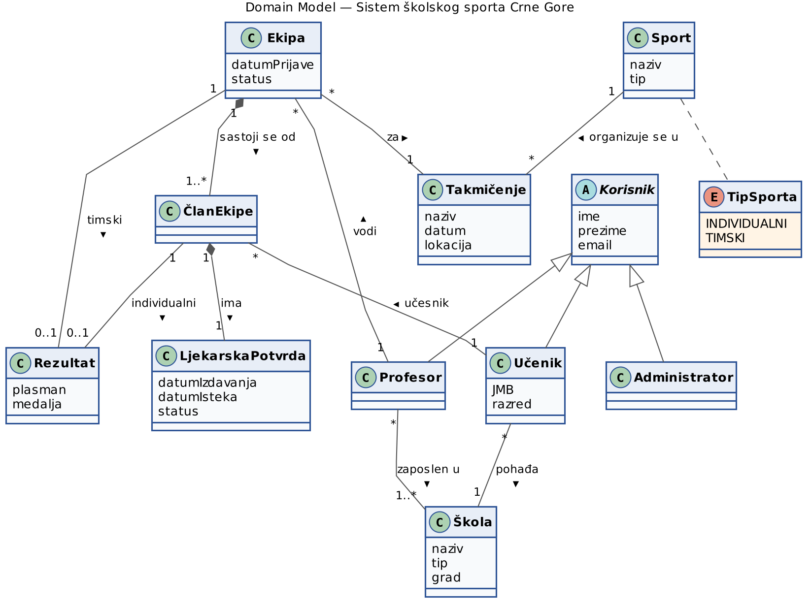
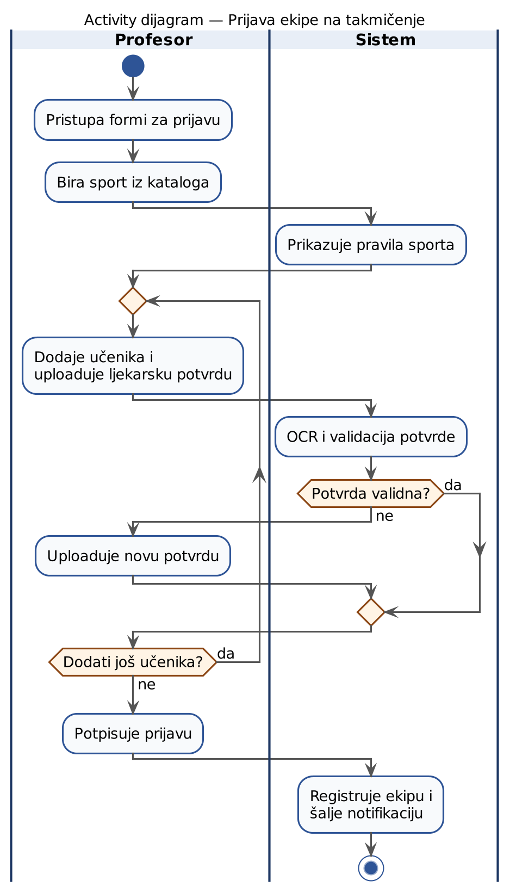
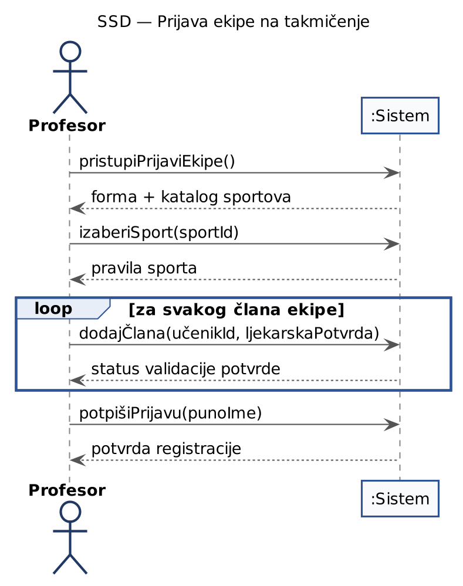

**SISTEM ŠKOLSKOG SPORTA**

**CRNE GORE**

*Projektna analitika*

Predmet: Analiza i dizajn informacionih sistema (ADIS)

Univerzitet Donja Gorica

*Verzija 3.1 \| 2026*

**1. Use Case dijagram**

Sistem ima tri primarna aktora (Profesor, Učenik, Administrator) i jedan
eksterni sistem (eDnevnik). Identifikovano je 10 ključnih use case-ova
sa dvije \<\<include\>\> relacije.

{width="5.625in"
height="6.177083333333333in"}

*Slika 1: Use Case dijagram*

**2. Use Case Briefs**

*Kratak opis svih use case-ova. Detaljna razrada centralnog UC5 (Prijava
ekipe) data je u sekciji 4.*

  --------------------------------------------------------------------
    **ID**   **Naziv**          **Aktor**       **Opis**
  ---------- ------------------ --------------- ----------------------
   **UC1**   **Registracija**   Profesor /      Korisnik kreira nalog
                                Učenik          uz osnovne lične
                                                podatke i podatke o
                                                školi.

   **UC2**   **Prijava na       Svi             Autentifikacija sa
             sistem**                           kredencijalima; sistem
                                                bilježi audit zapis.

   **UC3**   **Pregled profila  Profesor /      Pregled ličnih
             i istorije**       Učenik          podataka, vođenih
                                                timova, takmičenja,
                                                rezultata i medalja.

   **UC4**   **Pregled          Profesor /      Read-only pristup
             rasporeda**        Učenik          centralnom kalendaru
                                                takmičenja.

   **UC5**   **Prijava ekipe na Profesor        Centralni UC. Profesor
             takmičenje**                       formira ekipu, dodaje
                                                učenike, uploaduje
                                                ljekarske potvrde i
                                                potpisuje prijavu.

   **UC6**   **OCR validacija   Sistem          Automatska ekstrakcija
             potvrde**          (interni)       i provjera datuma i
                                                imena na ljekarskoj
                                                potvrdi.

   **UC7**   **Upravljanje      Administrator   CRUD nad nalozima i
             korisnicima i                      školama; verifikacija
             školama**                          kroz eDnevnik.

   **UC8**   **Verifikacija     Administrator   Provjera redovnosti i
             učenika                            statusa učenika kroz
             (eDnevnik)**                       državni sistem.

   **UC9**   **Upravljanje      Administrator   Katalog sportova
             sportovima i                       (timski /
             rasporedom**                       individualni) i
                                                kalendar takmičenja.

   **UC10**  **Unos rezultata** Administrator   Plasmani i medalje po
                                                završetku takmičenja;
                                                razlikuje timske od
                                                individualnih
                                                sportova.
  --------------------------------------------------------------------

**3. Domain Model**

Konceptualni klasni dijagram domena: 9 klasa i 1 enum. Korisnik je
apstraktna nadklasa za Profesora, Učenika i Administratora.

{width="6.25in"
height="4.677083333333333in"}

*Slika 2: Domain Model*

**Ključne odluke u modelovanju**

- Korisnik kao apstraktna klasa --- generalizacija u Profesora, Učenika
  i Administratora.

- ČlanEkipe je zasebna klasa između Učenika i Ekipe --- ima sopstvenu
  ljekarsku potvrdu po prijavi.

- Rezultat se vezuje za Ekipu (timski sport) ili za ČlanEkipe
  (individualni sport), nikad oba.

- Sport ima immutable tip (TIMSKI / INDIVIDUALNI) --- ne mijenja se
  nakon kreiranja zbog očuvanja istorijskih podataka.

**4. Detaljna razrada UC5: Prijava ekipe na takmičenje**

  ---------------- ----------------------------------
  **ID i naziv**   UC5 --- Prijaviti ekipu na
                   takmičenje

  **Primarni       Profesor
  aktor**          

  **Preduslovi**   Profesor je prijavljen i
                   verifikovan; učenici registrovani;
                   sport i takmičenje postoje u
                   sistemu.

  **Postuslovi**   Ekipa registrovana; potvrde
                   pohranjene i validirane;
                   notifikacija poslata.

  **Trigger**      Profesor pristupa formi za prijavu
                   ekipe.
  ---------------- ----------------------------------

**Glavni tok**

1\. Profesor pristupa formi za prijavu ekipe.

2\. Sistem prikazuje katalog sportova; profesor bira sport.

3\. Sistem prikazuje pravila sporta (tip, broj članova).

4\. Profesor dodaje učenika i uploaduje ljekarsku potvrdu.

5\. Sistem (UC6) OCR-uje potvrdu i validira datume i ime.

6\. Koraci 4--5 se ponavljaju za svakog člana ekipe.

7\. Profesor potpisuje prijavu unosom punog imena.

8\. Sistem registruje ekipu i šalje notifikaciju.

**Alternativni tokovi**

  -----------------------------------------------------
   **Tačka**  **Alternativa**
  ----------- -----------------------------------------
    **5a**    Potvrda istekla ili nevalidna --- sistem
              signalizira; profesor uploaduje novu
              validnu potvrdu.

    **5b**    OCR ne uspijeva (loš sken) --- sistem
              traži novi upload kvalitetnijeg
              dokumenta.

    **7a**    Potpis ne odgovara registrovanom imenu
              --- sistem odbija i traži ponovni unos.
  -----------------------------------------------------

**5. Activity dijagram i SSD**

**Activity dijagram**

Tok aktivnosti sa swimlanes-ima Profesor / Sistem i ključnom petljom za
dodavanje članova ekipe sa OCR validacijom.

{width="3.9583333333333335in"
height="6.9375in"}

*Slika 3: Activity dijagram*

**SSD**

System Sequence Diagram prikazuje sistem kao crnu kutiju. Iz SSD-a se
izvode sistemske operacije za narednu fazu razrade.

{width="4.791666666666667in"
height="6.072916666666667in"}

*Slika 4: SSD*

**Identifikovane sistemske operacije**

- pristupiPrijaviEkipe()

- izaberiSport(sportId)

- dodajČlana(učenikId, ljekarskaPotvrda)

- potpišiPrijavu(punoIme)

**6. CRUD matrica**

*Operacije svakog UC-a nad ključnim entitetima domena. C = Create, R =
Read, U = Update, D = Delete.*

  ------------------------------------------------------------------------------------------------------------------------------------------
  **UC**            **Korisnik**   **Škola**   **Sport**   **Takmičenje**   **Ekipa**   **ČlanEkipe**   **LjekarskaPotvrda**   **Rezultat**
  ---------------- -------------- ----------- ----------- ---------------- ----------- --------------- ---------------------- --------------
  **UC1                **C**         **R**                                                                                    
  Registracija**                                                                                                              

  **UC2 Prijava na     **R**                                                                                                  
  sistem**                                                                                                                    

  **UC3 Pregled        **R**         **R**       **R**         **R**          **R**         **R**                                 **R**
  profila**                                                                                                                   

  **UC4 Pregled                      **R**       **R**         **R**          **R**                                           
  rasporeda**                                                                                                                 

  **UC5 Prijava        **R**         **R**       **R**         **R**          **C**         **C**              **C**          
  ekipe**                                                                                                                     

  **UC6 OCR                                                                                                    **RU**         
  validacija**                                                                                                                

  **UC7               **CRUD**     **CRUD**                                                                                   
  Upravljanje                                                                                                                 
  korisnicima**                                                                                                               

  **UC8                **RU**        **R**                                                                                    
  Verifikacija                                                                                                                
  eDnevnik**                                                                                                                  

  **UC9 Sportovi i                              **CRU**       **CRUD**                                                        
  raspored**                                                                                                                  

  **UC10 Unos                                                  **R**          **R**         **R**                                **CRU**
  rezultata**                                                                                                                 
  ------------------------------------------------------------------------------------------------------------------------------------------

*Boje: zelena = C, siva = R, narandžasta = U, crvena = D.*

**Zapažanja**

- UC7 (Upravljanje korisnicima) ima CRUD nad dva entiteta ---
  najsrazmjerniji utjecaj.

- UC9 (Sportovi i raspored) --- Sport bez D operacije (deaktivacija
  umjesto brisanja, čuva integritet istorije).

- UC5 (Prijava ekipe) je read-heavy + create --- ne mijenja postojeće
  entitete domena.
