**SISTEM ŠKOLSKOG SPORTA**

**CRNE GORE**

*Projektni dizajn*

*Arhitektura • UI • API • Detaljni dizajn UC-ova • Komponente •
Pipeline*

Predmet: Analiza i dizajn informacionih sistema (ADIS)

Univerzitet Donja Gorica

*Verzija 1.2 \| 2026*

**1. Arhitektura sistema**

Sistem je projektovan kao Laravel monolit sa jasno odvojenim slojevima
(HTTP, Application, Domain, Infrastructure). Frontend nije zaseban
projekat --- Inertia.js most omogućava da se React komponente serviraju
direktno iz Laravel rute, čime se izbjegava komplikacija odvojenog
SPA-a.

**Slojevita arhitektura**

- HTTP sloj --- Controller-i primaju zahtjeve, validacija kroz Form
  Request klase, vraćaju Inertia odgovore.

- Application sloj --- Service klase koje orkestriraju biznis logiku
  (TeamRegistrationService, EDnevnikVerificationService).

- Domain sloj --- Eloquent modeli, enumi, value objekti koji
  predstavljaju koncepte domena.

- Infrastructure sloj --- Repository klase (data access) i Adapter klase
  (eksterni servisi).

**Komponentni dijagram**

Prikaz logičkih komponenti sistema i njihovih veza sa eksternim
sistemima.

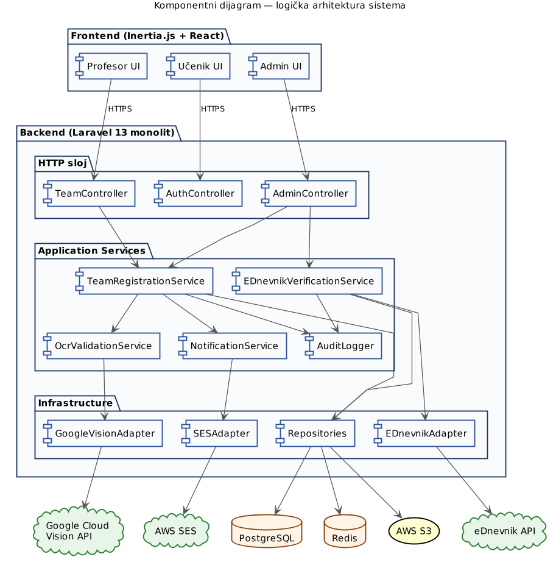{width="4.791666666666667in"
height="4.864583333333333in"}

*Slika 1: Komponentni dijagram*

**Ključne odluke**

- Monolit umjesto microservisa --- broj korisnika nije velik,
  kompleksnost deployment-a microservisa nije opravdana.

- Adapter pattern za eksterne sisteme --- eDnevnik, Google Vision i SES
  su iza adapter klasa, što omogućava lako mock-ovanje u testovima.

- Repository pattern --- apstrahuje Eloquent ORM iza interface-a, što
  čuva Service klase od direktnih ORM zavisnosti.

**2. Tehnološki stack i okruženje**

**Stack**

  -------------------------------------------------------------------------
  **Tehnologija**     **Verzija**  **Uloga**
  ------------------ ------------- ----------------------------------------
  **Laravel**            13.x      Backend framework --- rute,
                                   controller-i, ORM (Eloquent),
                                   validacija, autentifikacija, cache,
                                   queue.

  **PHP**                8.3+      Runtime za Laravel.

  **PostgreSQL**         16.x      Glavna baza podataka --- relacioni
                                   model, JSONB za fleksibilne strukture,
                                   full-text pretraga.

  **Redis**               7.x      Cache (sportovi, raspored), session
                                   storage, queue driver za background
                                   poslove.

  **Inertia.js**          1.x      Most između Laravel ruta i React
                                   komponenti --- SPA UX bez odvojenog
                                   projekta.

  **React**              18.x      Frontend komponente, renderovane kroz
                                   Inertia.

  **Tailwind CSS**        3.x      Utility-first CSS, konzistentan dizajn.

  **shadcn/ui**           ---      Komponente (forme, modali, tabele)
                                   bazirane na Radix UI primitivima.
  -------------------------------------------------------------------------

**Eksterni servisi**

  -----------------------------------------------------------------------
  **Servis**         **Svrha**
  ------------------ ----------------------------------------------------
  **Google Cloud     OCR ekstrakcija teksta sa ljekarskih potvrda ---
  Vision API**       najbolji za BCS dokumente sa miješanim
                     ćiriličnim/latiničnim sadržajem.

  **AWS SES**        Slanje transakcionih email notifikacija (potvrda
                     prijave, izmjena rasporeda, sigurnosna upozorenja).

  **eDnevnik API**   Eksterni državni sistem za verifikaciju statusa
                     učenika (redovan, škola, razred).
  -----------------------------------------------------------------------

**Hosting i okruženje (AWS)**

  -----------------------------------------------------------------------
  **Resurs**         **Konfiguracija**
  ------------------ ----------------------------------------------------
  **EC2              t3.medium instance sa Nginx + PHP-FPM, deploy kroz
  (Application)**    GitLab CI/CD pipeline.

  **RDS              db.t3.small, Multi-AZ za produkciju, automatski
  (PostgreSQL)**     backup-i 7 dana.

  **ElastiCache      cache.t3.micro, single-node za cache i session
  (Redis)**          storage.

  **S3**             Privatan bucket za ljekarske potvrde i fotografije,
                     signed URL-ovi sa kratkim TTL-om za pristup.

  **CloudFront**     CDN ispred S3 za fotografije; potvrde se serviraju
                     samo kroz aplikaciju (signed URL na zahtjev).

  **Route 53 + ACM** DNS i SSL sertifikati.
  -----------------------------------------------------------------------

*Backup i disaster recovery: dnevni snapshot RDS-a, S3 versioning sa
lifecycle pravilima, sve infrastrukture upravljano kroz Terraform.*

**3. Korisnički interfejs**

**Principi dizajna**

- Mobile-first responsive --- profesori često koriste sistem sa
  telefona; UI prilagođen tabletu i desktopu kroz iste komponente.

- Role-based dashboard --- svaka uloga (Profesor, Učenik, Administrator)
  ima dedicirani dashboard sa relevantnim akcijama.

- Konzistentnost --- shadcn/ui komponente kroz cijelu aplikaciju (forme,
  modali, tabele).

- Vidljiva validacija --- inline error poruke, OCR status indikatori
  (validna / istekla / nevalidna potvrda).

- Pristupačnost --- semantički HTML, kontrasti po WCAG AA, navigacija
  tastaturom.

- Otpornost na slabu konekciju --- autosave forme za prijavu ekipe,
  retry logika za upload-e potvrda.

**Wireframe-i ključnih ekrana**

**Login ekran**

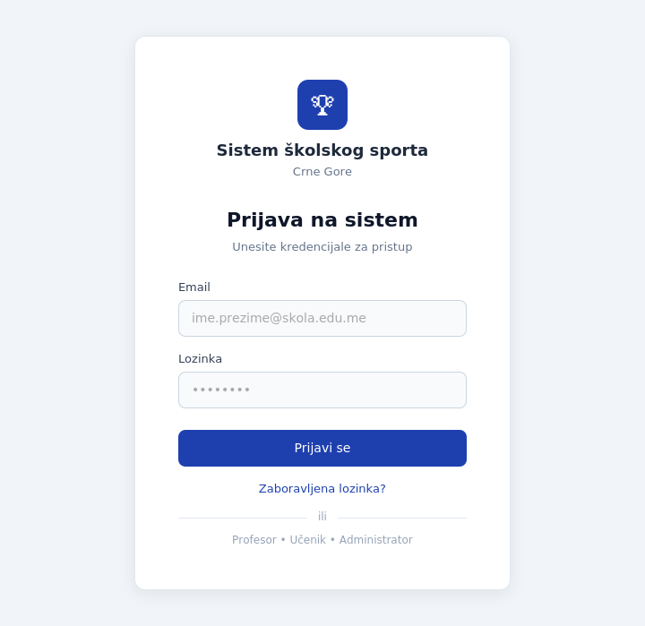{width="3.75in"
height="3.6458333333333335in"}

*Slika 2: Wireframe --- login ekran*

**Profesorski panel**

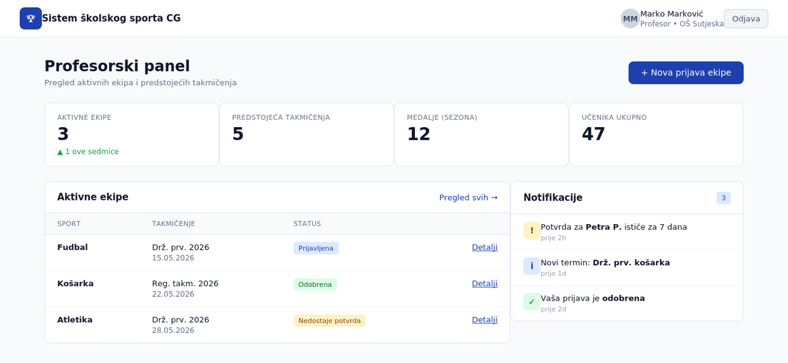{width="6.25in"
height="2.8854166666666665in"}

*Slika 3: Wireframe --- profesorski panel*

**Forma za prijavu ekipe**

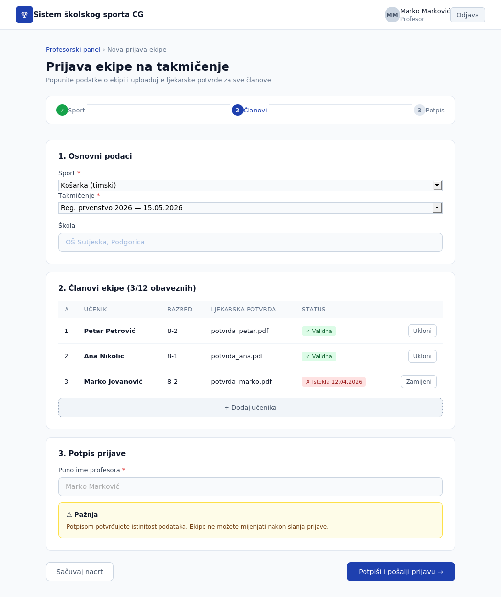{width="5.0in"
height="5.958333333333333in"}

*Slika 4: Wireframe --- forma za prijavu ekipe*

**Učenički profil**

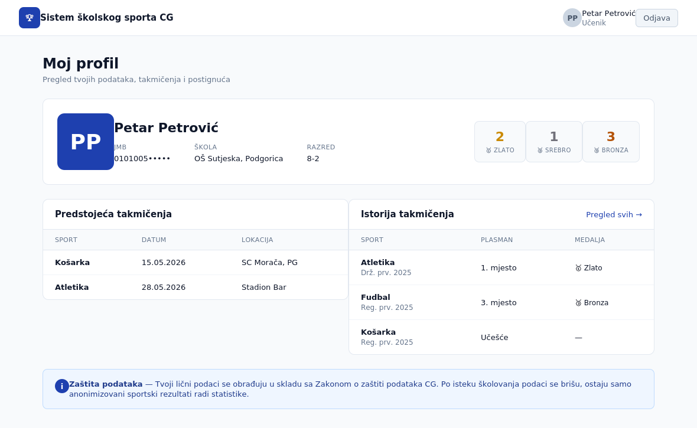{width="6.25in"
height="3.84375in"}

*Slika 5: Wireframe --- učenički profil*

**4. API interfejsi prema okruženju**

Sistem komunicira sa tri eksterna servisa preko HTTPS-a. Svaki ima
dedicirani Adapter koji enkapsulira HTTP klijent, autentifikaciju i
mapiranje odgovora u DTO-ove.

**4.1 eDnevnik API**

REST API državnog elektronskog dnevnika. Sistem ga koristi pri
verifikaciji učenika (UC8). Pristup uslovljen sporazumom sa
Ministarstvom prosvjete i AZLP saglasnošću.

**Endpoint: GET /students/{jmb}**

**Header-i:**

X-API-Key: \<key\>

Accept: application/json

**Odgovor (200 OK):**

{

\"jmb\": \"0101005250001\",

\"ime\": \"Petar\",

\"prezime\": \"Petrović\",

\"sifra_skole\": \"OS-PG-001\",

\"razred\": \"8-2\",

\"redovan\": true,

\"datum_zadnjeg_statusa\": \"2026-04-20\"

}

**Greške:**

- 404 --- učenik sa datim JMB-om ne postoji u eDnevniku

- 401 --- nevažeći ili istekli API ključ

- 429 --- prekoračenje rate limit-a (sistem implementira exponential
  backoff)

- 503 --- eDnevnik privremeno nedostupan (sistem označava verifikaciju
  kao \'pending\' i pokušava ponovo)

**4.2 Google Cloud Vision API**

Cloud servis za OCR i analizu dokumenata. Sistem ga koristi pri svakom
upload-u ljekarske potvrde (UC6).

**Endpoint: POST /v1/images:annotate**

*Autentifikacija: Service Account JSON ključ (čuva se u AWS Secrets
Manager).*

**Zahtjev:**

{

\"requests\": \[{

\"image\": { \"content\": \"\<base64\>\" },

\"features\": \[{ \"type\": \"DOCUMENT_TEXT_DETECTION\" }\],

\"imageContext\": { \"languageHints\": \[\"sr\", \"bs\", \"hr\"\] }

}\]

}

Sistem post-procesira odgovor: regex ekstrakcija datuma izdavanja i
isteka, pretraga imena učenika u tekstu, poređenje sa lokalnim zapisom.

**4.3 AWS SES**

Servis za slanje transakcionih email-ova. Sistem ga koristi za sve
notifikacije.

Pristup kroz AWS SDK (PHP). Šabloni email-ova čuvaju se kao Laravel
Notification klase. Bounce i complaint handling kroz SNS topic.

**Generalni principi za eksterne pozive**

- Timeout: 5s default, 10s za eDnevnik (zna biti spor).

- Retry: do 3 puta sa exponential backoff za 5xx i 429 greške.

- Circuit breaker: nakon 5 uzastopnih grešaka, servis se privremeno
  onemogućava (10 min).

- Observability: svi pozivi se loguju (latency, status, payload size) u
  CloudWatch.

**5. Detaljni dizajn UC5: Prijava ekipe na takmičenje**

**5.1 Design Class dijagram**

Prikazuje konkretne klase koje učestvuju u realizaciji UC5: Controller,
Form Request, Service-i, Repository-ji, Adapter, Eloquent Modeli i
DTO-ovi sa atributima i metodama.

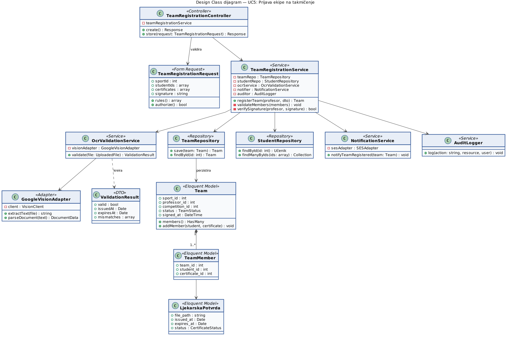{width="6.25in"
height="4.145833333333333in"}

*Slika 6: Design Class dijagram za UC5*

**5.2 Odgovornosti klasa**

  -------------------------------------------------------------------------------------
  **Klasa**                        **Odgovornost**
  -------------------------------- ----------------------------------------------------
  **TeamRegistrationController**   Prijem HTTP zahtjeva, delegacija na Service, Inertia
                                   odgovor.

  **TeamRegistrationRequest**      Validacija ulaza (sport, učenici, certifikati,
                                   potpis); definiše rules() i authorize().

  **TeamRegistrationService**      Orkestracija: validacija članova, OCR svake potvrde,
                                   potpis, perzistencija, notifikacija, audit.

  **OcrValidationService**         Poziv ka GoogleVisionAdapter, parsiranje teksta,
                                   validacija datuma i imena.

  **GoogleVisionAdapter**          Enkapsulacija Google Vision API klijenta, mapiranje
                                   odgovora u DocumentData strukturu.

  **TeamRepository /               Apstrakcija nad Eloquent modelima --- perzistencija,
  StudentRepository**              pretraga po ID-u.

  **NotificationService**          Slanje email notifikacija kroz SES, in-app
                                   notifikacije kroz Laravel broadcasting.

  **AuditLogger**                  Bilježenje akcije u immutable audit log (zaseban
                                   write-only repository).
  -------------------------------------------------------------------------------------

**5.3 Sequence dijagram**

Prikazuje vremensku interakciju objekata pri izvršenju UC5 --- od HTTP
zahtjeva profesora do potvrde registracije.

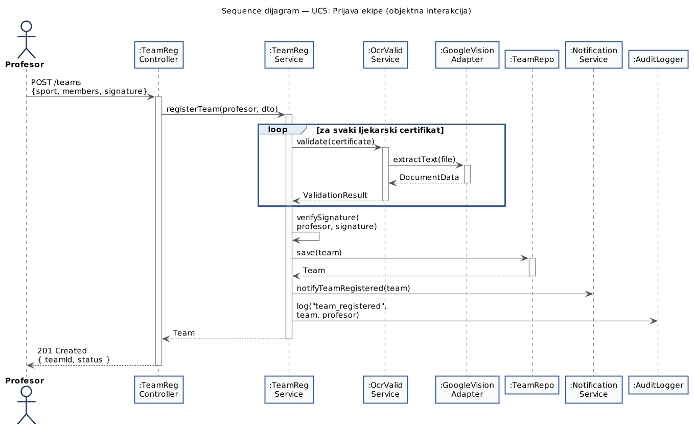{width="6.25in"
height="3.875in"}

*Slika 7: Sequence dijagram za UC5*

**5.4 Ključne tačke**

- OCR validacija u petlji --- svaki certifikat se validira posebno;
  greška u jednoj potvrdi ne ruši cijeli proces.

- Potpis je zadnji korak --- ako provjera potpisa padne, ekipa nije
  registrovana, ali su uploadovani certifikati zadržani u privremenom
  storage-u.

- Notifikacija i audit log su sinhroni dio toka --- moraju se desiti
  prije vraćanja odgovora profesoru.

**5.5 Komunikacioni dijagram**

Komunikacioni dijagram prikazuje istu interakciju kao sequence dijagram,
ali sa fokusom na strukturne veze između objekata umjesto vremenskog
redoslijeda. Numerisane poruke (1, 2, 3, 3.1, 3.2\...) jasno pokazuju
hijerarhiju poziva.

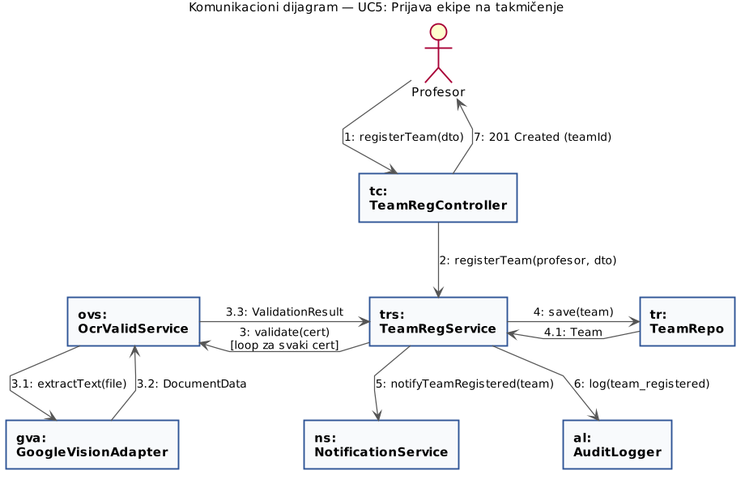{width="5.625in"
height="3.625in"}

*Slika 7a: Komunikacioni dijagram za UC5*

**6. Detaljni dizajn UC8: Verifikacija učenika (eDnevnik)**

**6.1 Design Class dijagram**

Prikazuje klase koje učestvuju u verifikaciji učenika kroz eksterni
eDnevnik sistem.

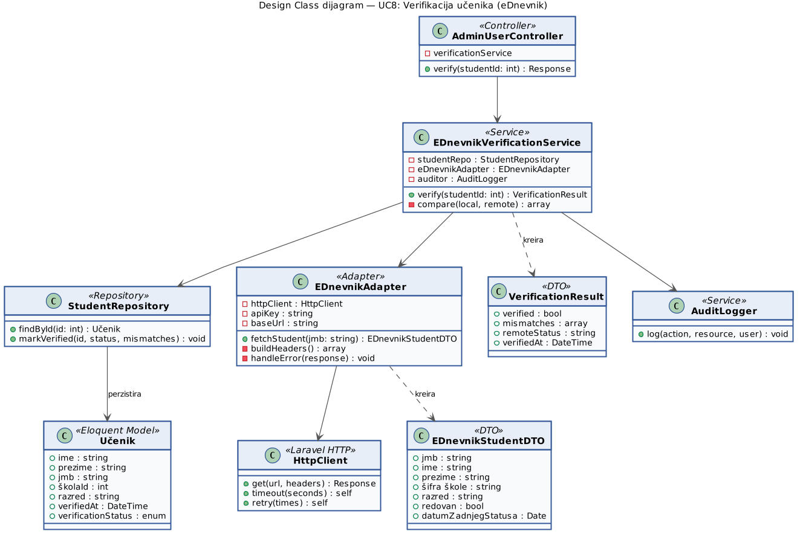{width="6.25in"
height="4.197916666666667in"}

*Slika 8: Design Class dijagram za UC8*

**6.2 Odgovornosti klasa**

  --------------------------------------------------------------------------------------
  **Klasa**                         **Odgovornost**
  --------------------------------- ----------------------------------------------------
  **AdminUserController**           Endpoint za verifikaciju učenika; samo Admin može
                                    pristupiti.

  **EDnevnikVerificationService**   Dohvat lokalnih podataka, poziv eDnevnika,
                                    poređenje, ažuriranje statusa, audit.

  **EDnevnikAdapter**               HTTP komunikacija sa eDnevnikom --- autentifikacija,
                                    retry, mapiranje JSON-a u DTO.

  **HttpClient**                    Laravel HTTP klijent, omogućava timeout-e i retry
                                    pattern.

  **EDnevnikStudentDTO**            Transfer objekat sa eDnevnik podacima (immutable).

  **VerificationResult**            Rezultat verifikacije --- flag verified, lista
                                    neslaganja ako postoji.

  **StudentRepository**             Lokalna pretraga i markVerified ažuriranje.
  --------------------------------------------------------------------------------------

**6.3 Sequence dijagram**

Prikazuje interakciju sa eksternim eDnevnik API-jem (boundary objekat)
kao i alternativne tokove pri podudaranju i nepodudaranju podataka.

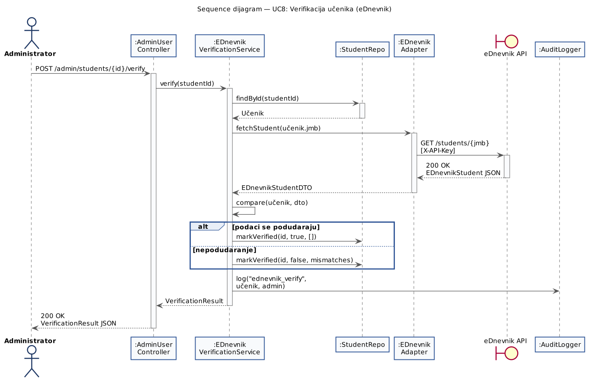{width="6.25in"
height="4.041666666666667in"}

*Slika 9: Sequence dijagram za UC8*

**6.4 Ključne tačke**

- Adapter pattern u akciji --- EDnevnikAdapter sakriva HTTP detalje od
  Service-a; ako se eDnevnik API promijeni, mijenja se samo adapter.

- DTO razdvajanje --- EDnevnikStudentDTO predstavlja eksternu strukturu,
  koja se ne smije miješati sa Eloquent modelom Učenika.

- Bilježenje neslaganja --- pri nepodudaranju, sistem ne briše već
  markira učenika kao \'unverified\' sa listom razlika; admin manualno
  odlučuje šta dalje.

- Audit log obavezan --- svaki pristup eDnevniku se loguje (AZLP zahtjev
  za pristup obrazovnim podacima maloljetnika).

**6.5 Komunikacioni dijagram**

Komunikacioni dijagram pokazuje strukturne veze između objekata pri
verifikaciji učenika. Eksterni sistem eDnevnik je prikazan kao boundary
objekat sa kojim komunicira EDnevnikAdapter.

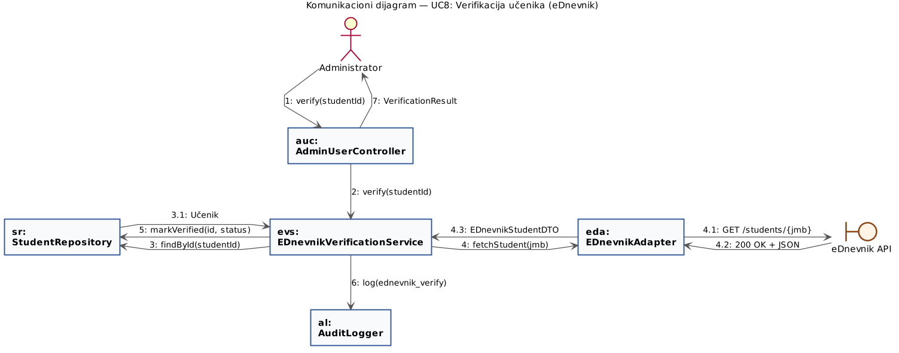{width="6.25in"
height="2.4583333333333335in"}

*Slika 9a: Komunikacioni dijagram za UC8*

**7. Package dijagram**

Prikazuje strukturu Laravel projekta --- kako su klase organizovane u
pakete (foldere) po slojevima i koje su zavisnosti među paketima.

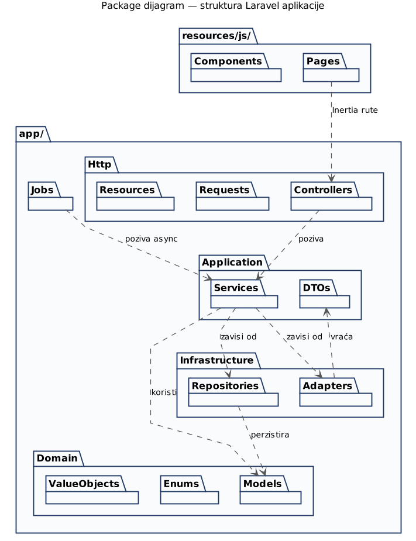{width="3.9583333333333335in"
height="5.15625in"}

*Slika 10: Package dijagram*

**Layering pravila**

- Http zavisi od Application --- Controller-i pozivaju Service-e, ne
  direktno modele ili repository-je.

- Application zavisi od Domain i Infrastructure --- Service-i koriste
  modele i repository-je/adaptere.

- Domain je nezavisan --- modeli i value objekti ne smiju zavisiti od
  Service-a, Repository-ja ili Controller-a.

- Infrastructure zavisi samo od Domain --- Repository-ji i Adapter-i
  koriste modele kao return type, ali nemaju biznis logiku.

- Frontend (resources/js) komunicira sa Controller-ima kroz Inertia
  rute, bez direktnog pristupa Service-ima.

**8. Pipeline plan za implementaciju**

Plan razrade sistema u fazama. Svaka faza ima procijenjeno trajanje i
konkretne deliverable-e.

  --------------------------------------------------------------------------------------
      **Faza**     **Sadržaj**                          **Trajanje**  **Deliverable**
  ---------------- ----------------------------------- -------------- ------------------
    **1. Setup**   Inicijalizacija Laravel 13            1 nedjelja   Repo sa CI/CD, AWS
                   projekta, Inertia + React, baza,                   dev okruženje
                   GitLab CI/CD, AWS infrastruktura                   
                   kroz Terraform.                                    

  **2. Migracije i Eloquent migracije svih entiteta iz   1 nedjelja   Database schema,
      modeli**     Domain Modela, modeli sa                           modeli, factory-ji
                   relacijama, factory-ji, seed                       
                   podaci.                                            

    **3. Auth +    Laravel Sanctum autentifikacija,    1--2 nedjelje  Autentifikacija,
    Korisnici**    role-based middleware,                             korisnički
                   registracija/login forme,                          management
                   korisnički CRUD.                                   

    **4. UC5 ---   Glavni feature.                       3 nedjelje   Funkcionalna
  Prijava ekipe**  TeamRegistrationService, OCR                       prijava ekipe
                   integracija, forma sa upload-om                    
                   potvrda, potpis logika.                            

    **5. UC8 ---   EDnevnikAdapter, verifikacijski       2 nedjelje   Verifikacija
     eDnevnik**    tok, admin UI za verifikaciju, mock                učenika
                   eDnevnika za dev (dok ne stigne                    
                   sporazum).                                         

  **6. Raspored i  Admin upravljanje rasporedom, unos    2 nedjelje   Kompletan ciklus
    rezultati**    rezultata, distribucija medalja,                   takmičenja
                   ažuriranje profila.                                

        **7.       Profesorski panel, učenički profil,   2 nedjelje   Sva tri korisnička
   Dashboardovi**  admin panel sa filtrima i                          UI-ja
                   agregacijama.                                      

  **8. Audit log + Immutable audit log servis, UC za     1 nedjelja   AZLP usklađenost
     brisanje**    brisanje podataka po isteku                        
                   školovanja, anonimizacija                          
                   rezultata.                                         

        **9.       Unit testovi (Pest), feature          2 nedjelje   Test coverage \>
    Testiranje**   testovi za ključne UC-ove, E2E                     70%, pass UAT
                   testovi, security audit.                           

   **10. Pilot +   Pilot u 1--2 škole, korekcije,       2--3 mjeseca  Sistem u
     rollout**     postepeni rollout po regijama,                     produkciji
                   dokumentacija za korisnike.                        
  --------------------------------------------------------------------------------------

**Kritične zavisnosti**

- Sporazum sa Ministarstvom prosvjete za eDnevnik pristup --- može
  blokirati Fazu 5; predviđen mock eDnevnika za dev.

- AZLP saglasnost za obradu podataka maloljetnika --- mora biti riješeno
  prije pilota.

- Pravna validnost digitalnih ljekarskih potvrda --- usaglasiti sa
  Ministarstvom zdravlja prije produkcije.

*--- Kraj projektnog dizajna ---*
