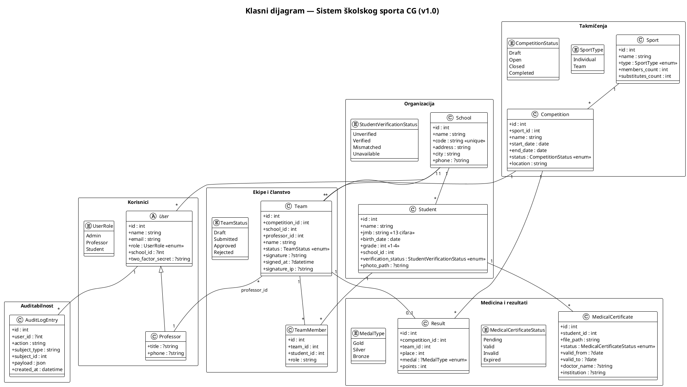
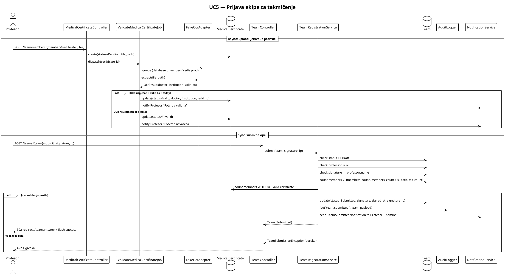
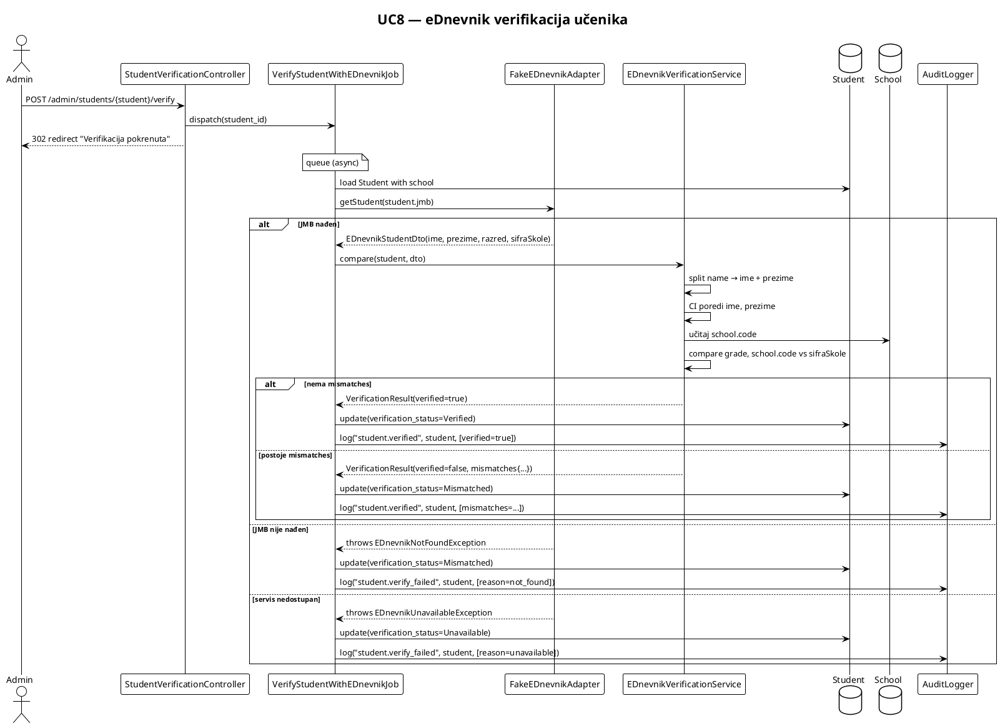
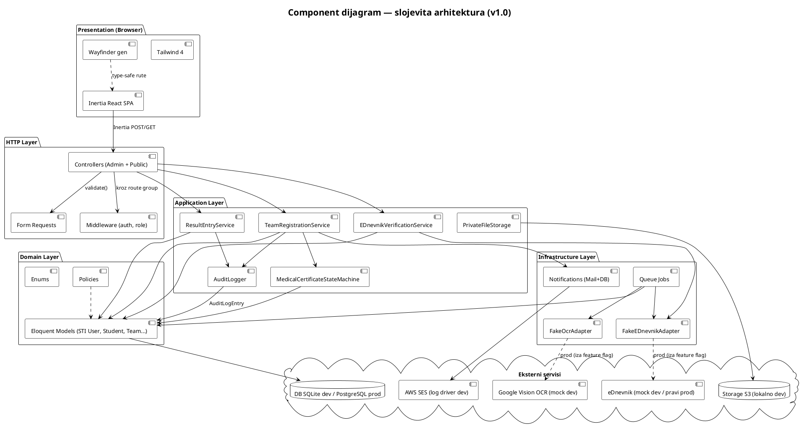
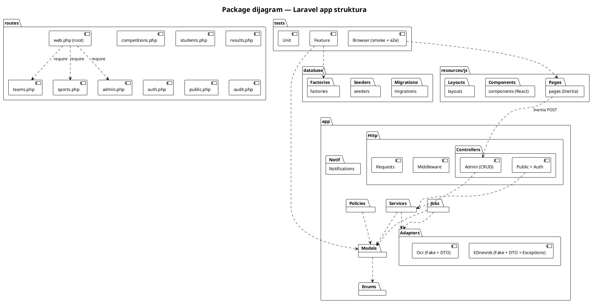
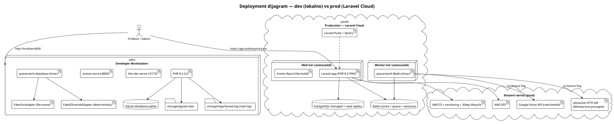

# T4.1 — Faza 4: UML dijagrami (6 vrsta) — Implementation Plan

> **For agentic workers:** REQUIRED SUB-SKILL: Use superpowers:subagent-driven-development (recommended) or superpowers:executing-plans to implement this plan task-by-task. Steps use checkbox (`- [ ]`) syntax for tracking.

**Goal:** Šest UML dijagrama (klasni, sequence UC5, sequence UC8, component, package, deployment) generisanih iz **stvarno implementiranog koda** (Phase 0–3, v1.0 tag), spremljenih kao PlantUML izvor + render PNG/SVG u `docs/zavrsni-izvjestaj/uml/`.

**Architecture:** PlantUML izvor (`.puml`) komitujemo u git (versionable, diffable). Render slike (`.png`) ide u poddir `render/`. Mermaid backup samo za GitHub Markdown preview embed-ovanje. Klasni dijagram iz `app/Models/` + `app/Enums/`; sequence dijagrami iz `app/Http/Controllers/` + `app/Services/` + `app/Adapters/` + `app/Jobs/`; component dijagram iz spec §9.2 + adapter pattern; package dijagram iz Laravel app strukture; deployment dijagram iz `composer.json` + `.env.example` + spec §11.

**Tech Stack:** PlantUML (lokalni `plantuml.jar` ili VS Code "PlantUML" extension), Markdown za inline embed, Mermaid fallback.

---

## Pre-flight

- [ ] **Step 1: Provjeri da je T3.2 merge-an i v1.0 tag postoji**

```powershell
git log --oneline -5
git tag --list 'v1.0'
```

Expected: zadnji commit je merge T3.2 ili kasniji, `v1.0` tag postoji.

- [ ] **Step 2: Kreiraj worktree za T4.1**

```powershell
git worktree add ../sportski-savez-app-t4.1 -b feature/t4.1-uml-dijagrami
```

Expected: novi direktorij `../sportski-savez-app-t4.1/` sa istim sadržajem kao main.

- [ ] **Step 3: Provjeri da je PlantUML dostupan**

Probaj prvo CLI:

```powershell
plantuml -version
```

Ako nije instaliran, koristi Docker fallback (preferira se za reproducibility):

```powershell
docker run --rm -v ${PWD}:/data plantuml/plantuml -version
```

Ako ni Docker nije dostupan, **dokumentuj u PR opisu** da se render mora pokrenuti ručno preko VS Code "PlantUML" extension-a (Alt+D za preview). Izvor (`.puml`) je svejedno glavni deliverable, render je za vizualnu provjeru.

- [ ] **Step 4: Kreiraj direktorijsku strukturu**

```powershell
mkdir docs/zavrsni-izvjestaj/uml
mkdir docs/zavrsni-izvjestaj/uml/render
```

---

## Task 1: Klasni dijagram — domain model

**Files:**
- Create: `docs/zavrsni-izvjestaj/uml/01-klasni-dijagram.puml`
- Reference: `app/Models/*.php`, `app/Enums/*.php`, `database/migrations/*.php`

**Entiteti za uključiti (svih 11 iz spec §7.1 + audit log + STI hijerarhija):**

| Entitet | Fajl | Ključni atributi |
|---|---|---|
| `User` (apstraktni baseclass) | `app/Models/User.php` | id, name, email, role (enum), two_factor_secret, school_id |
| `Professor` (STI subklasa) | `app/Models/Professor.php` | (extends User), title, phone |
| `Student` | `app/Models/Student.php` | id, name, jmb, birth_date, grade, school_id, verification_status (enum), photo_path |
| `School` | `app/Models/School.php` | id, name, code, address, city, phone |
| `Sport` | `app/Models/Sport.php` | id, name, type (enum), members_count, substitutes_count |
| `Competition` | `app/Models/Competition.php` | id, sport_id, name, start_date, end_date, status (enum), location |
| `Team` | `app/Models/Team.php` | id, competition_id, school_id, professor_id, name, status (enum), signature, signed_at, signature_ip |
| `TeamMember` | `app/Models/TeamMember.php` | id, team_id, student_id, role |
| `MedicalCertificate` | `app/Models/MedicalCertificate.php` | id, student_id, file_path, status (enum), valid_from, valid_to, doctor_name, institution |
| `Result` | `app/Models/Result.php` | id, competition_id, team_id, place, medal (enum), points |
| `AuditLogEntry` | `app/Models/AuditLogEntry.php` | id, user_id, action, subject_type, subject_id, payload (json), created_at |
| **Enum-i** | `app/Enums/*.php` | UserRole, SportType, TeamStatus, MedicalCertificateStatus, StudentVerificationStatus, MedalType, CompetitionStatus |

**Relacije:**

- `School 1—* User` (`users.school_id`)
- `School 1—* Student` (`students.school_id`)
- `School 1—* Team` (`teams.school_id`)
- `Sport 1—* Competition` (`competitions.sport_id`)
- `Competition 1—* Team` (`teams.competition_id`)
- `Competition 1—* Result` (`results.competition_id`)
- `Team 1—* TeamMember` (`team_members.team_id`)
- `Team 1—1 Result` (`results.team_id`, unique)
- `Team *—1 User` (`teams.professor_id` → User sa role=Professor)
- `Student 1—* TeamMember` (`team_members.student_id`)
- `Student 1—* MedicalCertificate` (`medical_certificates.student_id`)
- `User 1—* AuditLogEntry` (`audit_log_entries.user_id`)

- [ ] **Step 1: Napiši PlantUML izvor**



- [ ] **Step 2: Render**

```powershell
plantuml docs/zavrsni-izvjestaj/uml/01-klasni-dijagram.puml -o render/
```

Ako PlantUML nije instaliran lokalno, otvori `.puml` u VS Code → Alt+D → desni klik na preview → "Export Current Diagram" → PNG → snimi u `docs/zavrsni-izvjestaj/uml/render/01-klasni-dijagram.png`.

- [ ] **Step 3: Vizualna provjera**

Otvori `render/01-klasni-dijagram.png` i provjeri:
- Svih 11 entiteta + 7 enum-a vidljivih
- Sve relacije čitljive (nema preklopa linija)
- STI relacija User → Professor jasno označena
- Nazivi atributa i tipova čitljivi

Ako je prenatrpan, podijeli u dva poddijagrama (Domain+Korisnici i Procesi+Audit) i ažuriraj komentare ovdje.

- [ ] **Step 4: Commit**

```powershell
git add docs/zavrsni-izvjestaj/uml/01-klasni-dijagram.puml docs/zavrsni-izvjestaj/uml/render/01-klasni-dijagram.png
git commit -m "docs(uml): add class diagram of domain model"
```

---

## Task 2: Sequence dijagram UC5 — Prijava ekipe

**Files:**
- Create: `docs/zavrsni-izvjestaj/uml/02-sequence-uc5.puml`
- Reference: `app/Http/Controllers/TeamController.php`, `app/Services/TeamRegistrationService.php`, `app/Adapters/Ocr/FakeOcrAdapter.php`, `app/Jobs/ValidateMedicalCertificateJob.php`, `tests/Feature/Team/TeamSubmitTest.php`

**Učesnici:** Profesor (Actor), TeamController, TeamRegistrationService, MedicalCertificate (model), ValidateMedicalCertificateJob (queue), FakeOcrAdapter, AuditLogger, NotificationService.

**Tok (iz `TeamRegistrationService::submit()`):**

1. Profesor → `POST /teams/{team}/submit` sa potpisom u tijelu
2. `TeamController::submit()` → `TeamRegistrationService::submit($team, $signature, $ip)`
3. Service provjerava: status=Draft, professor postoji, potpis==professor.name, broj članova u rasponu sport.members_count..members+substitutes, svi članovi imaju MedicalCertificate.status=Valid
4. Ako neka od provjera padne → `TeamSubmissionException`, vrati 422
5. DB transakcija: Team.status=Submitted, signature, signed_at, signature_ip
6. AuditLogger: `team.submitted` zapis
7. NotificationService: pošalji `TeamSubmittedNotification` profesoru + svim adminima
8. Vrati 200/redirect na `/teams/{team}` sa flash porukom

**Async grana (prije submit-a — pri upload-u potvrde):**

A. Profesor → `POST /team-members/{member}/certificate` (upload PDF/sliku)
B. `MedicalCertificateController` → kreira MedicalCertificate sa status=Pending
C. Dispatch `ValidateMedicalCertificateJob` (queue)
D. Job → `FakeOcrAdapter::extract($file_path)` → vraća `OcrResult` (doctor_name, institution, valid_to)
E. Job → `MedicalCertificate::update(status=Valid/Invalid)` po pravilima
F. Notifikacija profesoru

- [ ] **Step 1: Napiši PlantUML izvor**



- [ ] **Step 2: Render**

```powershell
plantuml docs/zavrsni-izvjestaj/uml/02-sequence-uc5.puml -o render/
```

- [ ] **Step 3: Vizualna provjera**

Provjeri da su obje grane (async upload + sync submit) jasno odvojene. Provjeri da `alt/else` blokovi pokazuju i happy path i error path.

- [ ] **Step 4: Commit**

```powershell
git add docs/zavrsni-izvjestaj/uml/02-sequence-uc5.puml docs/zavrsni-izvjestaj/uml/render/02-sequence-uc5.png
git commit -m "docs(uml): add UC5 sequence diagram (team submission)"
```

---

## Task 3: Sequence dijagram UC8 — eDnevnik verifikacija učenika

**Files:**
- Create: `docs/zavrsni-izvjestaj/uml/03-sequence-uc8.puml`
- Reference: `app/Http/Controllers/Admin/StudentVerificationController.php`, `app/Services/EDnevnikVerificationService.php`, `app/Adapters/EDnevnik/FakeEDnevnikAdapter.php`, `app/Jobs/VerifyStudentWithEDnevnikJob.php`, `tests/Feature/Admin/StudentVerificationTest.php`

**Učesnici:** Admin (Actor), StudentVerificationController, VerifyStudentWithEDnevnikJob, FakeEDnevnikAdapter, EDnevnikVerificationService, Student (model), AuditLogger.

**Tok (iz `EDnevnikVerificationService::compare()`):**

1. Admin → `POST /admin/students/{student}/verify`
2. Controller dispatch `VerifyStudentWithEDnevnikJob(student_id)`
3. Job → `FakeEDnevnikAdapter::getStudent(student.jmb)`
   - Deterministički: parsira JMB → DOB + region kod → DTO sa ime, prezime, razred, sifra_skole
   - Ako specific test JMB → `EDnevnikNotFoundException` / `EDnevnikUnavailableException`
4. Adapter vraća `EDnevnikStudentDto`
5. Job → `EDnevnikVerificationService::compare(student, dto)`:
   - Split `student.name` na prvi razmak → ime + prezime
   - CI poređenje ime, prezime
   - Poređenje grade (kao string), school.code vs dto.sifraSkole
   - Vrati `VerificationResult(verified, mismatches[])`
6. Ako `verified` → `Student.update(verification_status=Verified)`
7. Ako `mismatches` → `Student.update(verification_status=Mismatched)`
8. Ako exception → `Student.update(verification_status=Unavailable)`
9. AuditLogger: `student.verified` sa payload-om mismatches
10. Admin vidi rezultat na sljedećem refresh-u (job je async)

- [ ] **Step 1: Napiši PlantUML izvor**



- [ ] **Step 2: Render**

```powershell
plantuml docs/zavrsni-izvjestaj/uml/03-sequence-uc8.puml -o render/
```

- [ ] **Step 3: Vizualna provjera**

Provjeri da sve tri grane (verified / mismatched / not_found / unavailable) jasno vidljive. Provjeri da je name-split logika (split first space → ime + prezime) eksplicitno označena.

- [ ] **Step 4: Commit**

```powershell
git add docs/zavrsni-izvjestaj/uml/03-sequence-uc8.puml docs/zavrsni-izvjestaj/uml/render/03-sequence-uc8.png
git commit -m "docs(uml): add UC8 sequence diagram (eDnevnik verification)"
```

---

## Task 4: Component dijagram — slojevita arhitektura

**Files:**
- Create: `docs/zavrsni-izvjestaj/uml/04-component-dijagram.puml`
- Reference: spec §9.2, `app/` struktura

**Komponente:**

- **Presentation Layer:** Inertia React (resources/js), Tailwind, Wayfinder gen
- **HTTP Layer:** Controllers (admin + nonadmin), Middleware (auth, role), Form Requests
- **Application Layer:** Services (TeamRegistrationService, EDnevnikVerificationService, ResultEntryService, AuditLogger, PrivateFileStorage), State machines (MedicalCertificateStateMachine)
- **Domain Layer:** Eloquent Models (User STI, Student, Team, MedicalCertificate, ...), Policies, Enums
- **Infrastructure Layer:** Adapters (FakeOcrAdapter, FakeEDnevnikAdapter), Notifications, Jobs (queue)
- **Eksterni servisi:** eDnevnik (mock), Google Vision OCR (mock), AWS SES (log driver dev), AWS S3 (local storage dev), Database (SQLite dev / PostgreSQL prod)

- [ ] **Step 1: Napiši PlantUML izvor**



- [ ] **Step 2: Render**

```powershell
plantuml docs/zavrsni-izvjestaj/uml/04-component-dijagram.puml -o render/
```

- [ ] **Step 3: Vizualna provjera**

Provjeri da adapter pattern (Fake*Adapter → eksterni servis iza feature flag) jasno vidljiv. Provjeri da slojevi imaju jednosmjerne strelice (Presentation → HTTP → Application → Domain).

- [ ] **Step 4: Commit**

```powershell
git add docs/zavrsni-izvjestaj/uml/04-component-dijagram.puml docs/zavrsni-izvjestaj/uml/render/04-component-dijagram.png
git commit -m "docs(uml): add component diagram (layered architecture)"
```

---

## Task 5: Package dijagram — Laravel app struktura

**Files:**
- Create: `docs/zavrsni-izvjestaj/uml/05-package-dijagram.puml`
- Reference: `app/`, `resources/js/`, `routes/`, `database/`, `tests/` struktura iz git tree

**Paketi:**

- `app/Http/Controllers` (split: `Admin/` + root) → 21 controller
- `app/Models` → 12 modela
- `app/Services` → 9 servisa
- `app/Adapters/EDnevnik`, `app/Adapters/Ocr` → 2 fake adaptera + DTO
- `app/Jobs` → 3 job-a
- `app/Enums` → 7 enum-a
- `app/Notifications` → email + database
- `app/Policies` → po model
- `routes/` → 12 split fajlova (`web.php`, `admin.php`, `teams.php`, `sports.php`, `competitions.php`, `students.php`, `results.php`, `auth.php`, `settings.php`, `audit.php`, `public.php`, `console.php`)
- `resources/js/pages` → Inertia React stranice
- `resources/js/components` → React komponente (FormCard, side panel, sidebar)
- `database/migrations` → 13 migracija
- `database/seeders` → seeders + AiDnevnikSeeder
- `database/factories` → factories per model
- `tests/Feature` → ~50 feature testova
- `tests/Browser` → smoke + integration

- [ ] **Step 1: Napiši PlantUML izvor**



- [ ] **Step 2: Render**

```powershell
plantuml docs/zavrsni-izvjestaj/uml/05-package-dijagram.puml -o render/
```

- [ ] **Step 3: Vizualna provjera**

Provjeri da je `routes/` split jasno vidljiv (12 fajlova umjesto monolitnog `web.php`). Provjeri da je Inertia veza Pages → Controllers prikazana.

- [ ] **Step 4: Commit**

```powershell
git add docs/zavrsni-izvjestaj/uml/05-package-dijagram.puml docs/zavrsni-izvjestaj/uml/render/05-package-dijagram.png
git commit -m "docs(uml): add package diagram (app structure)"
```

---

## Task 6: Deployment dijagram — dev + prod

**Files:**
- Create: `docs/zavrsni-izvjestaj/uml/06-deployment-dijagram.puml`
- Reference: `composer.json`, `.env.example`, spec §10.3, §11

**Dev okruženje:**
- Single workstation (Windows / macOS / Linux)
- PHP 8.3 (php-cli)
- Vite dev server (port 5173)
- Laravel artisan serve (port 8000)
- SQLite (database/database.sqlite)
- Queue: database driver (sync ili queue:work)
- Cache: database driver
- Mail: log driver (storage/logs/laravel.log)
- Storage: storage/app/private (local filesystem)
- OCR: FakeOcrAdapter (file-name konvencija)
- eDnevnik: FakeEDnevnikAdapter (deterministic by JMB)

**Prod (Laravel Cloud target):**
- Laravel Cloud (autoscaling)
- PostgreSQL managed (cluster + read replika)
- Redis (cache + queue + sessions)
- AWS S3 (storage + versioning + lifecycle)
- AWS SES (production)
- Google Vision API (rate-limited, iza feature flag)
- eDnevnik HTTP API (iza feature flag, Ministarstvo prosvjete)
- CloudWatch + Sentry monitoring
- Laravel Pulse dashboard

- [ ] **Step 1: Napiši PlantUML izvor**



- [ ] **Step 2: Render**

```powershell
plantuml docs/zavrsni-izvjestaj/uml/06-deployment-dijagram.puml -o render/
```

- [ ] **Step 3: Vizualna provjera**

Provjeri da su dev i prod okruženja jasno odvojena. Provjeri da je "iza feature flag" oznaka prisutna na Vision i eDnevnik vezama.

- [ ] **Step 4: Commit**

```powershell
git add docs/zavrsni-izvjestaj/uml/06-deployment-dijagram.puml docs/zavrsni-izvjestaj/uml/render/06-deployment-dijagram.png
git commit -m "docs(uml): add deployment diagram (dev vs Laravel Cloud)"
```

---

## Task 7: README za UML poddir

**Files:**
- Create: `docs/zavrsni-izvjestaj/uml/README.md`

- [ ] **Step 1: Napiši README**

```markdown
# UML dijagrami — Sistem školskog sporta CG (v1.0)

Šest UML dijagrama generisanih iz **stvarno implementiranog koda** (Phase 0–3, v1.0 tag), spremljenih kao PlantUML izvor + PNG render.

| # | Dijagram | Izvor | Render | Pokriva |
|---|---|---|---|---|
| 1 | Klasni dijagram | [01-klasni-dijagram.puml](01-klasni-dijagram.puml) | [render/01-klasni-dijagram.png](render/01-klasni-dijagram.png) | Domain model: 11 entiteta + 7 enum-a + STI hijerarhija User/Professor |
| 2 | Sequence UC5 | [02-sequence-uc5.puml](02-sequence-uc5.puml) | [render/02-sequence-uc5.png](render/02-sequence-uc5.png) | Prijava ekipe: upload potvrde (async OCR) + submit (sync sa potpisom) |
| 3 | Sequence UC8 | [03-sequence-uc8.puml](03-sequence-uc8.puml) | [render/03-sequence-uc8.png](render/03-sequence-uc8.png) | eDnevnik verifikacija (3 grane: verified/mismatched/unavailable) |
| 4 | Component dijagram | [04-component-dijagram.puml](04-component-dijagram.puml) | [render/04-component-dijagram.png](render/04-component-dijagram.png) | Slojevita arhitektura: Presentation → HTTP → Application → Domain + Infrastructure |
| 5 | Package dijagram | [05-package-dijagram.puml](05-package-dijagram.puml) | [render/05-package-dijagram.png](render/05-package-dijagram.png) | Laravel app struktura: 21 controller, 12 modela, 12 split route fajlova |
| 6 | Deployment dijagram | [06-deployment-dijagram.puml](06-deployment-dijagram.puml) | [render/06-deployment-dijagram.png](render/06-deployment-dijagram.png) | Dev (lokalno SQLite+log mail) vs prod (Laravel Cloud + PostgreSQL + Redis + S3 + SES + Vision + eDnevnik) |

## Render-ovanje izvora

Lokalni render preko PlantUML CLI:

```bash
plantuml docs/zavrsni-izvjestaj/uml/*.puml -o render/
```

Ili preko Dockera:

```bash
docker run --rm -v ${PWD}:/data plantuml/plantuml docs/zavrsni-izvjestaj/uml/*.puml -o render/
```

Ili VS Code: instaliraj "PlantUML" extension, otvori `.puml` fajl, Alt+D za preview, desni klik → Export Current Diagram → PNG.

## Referenca

- Spec §7 (Domain model), §9 (Arhitektura), §10 (Stack), §11 (Deployment)
- T4.1 plan: [`specs/140-t4.1-uml-dijagrami.md`](../../../specs/140-t4.1-uml-dijagrami.md)
```

- [ ] **Step 2: Commit**

```powershell
git add docs/zavrsni-izvjestaj/uml/README.md
git commit -m "docs(uml): add README index for UML directory"
```

---

## Task 8: Finalizacija — provjera + PR

- [ ] **Step 1: Provjeri sve fajlove**

```powershell
ls docs/zavrsni-izvjestaj/uml/
ls docs/zavrsni-izvjestaj/uml/render/
```

Expected:
- 6 `.puml` fajlova
- 6 `.png` render fajlova (ili dokumentovano u PR-u zašto neki nisu render-ovani — npr. PlantUML nije bio dostupan)
- 1 `README.md`

- [ ] **Step 2: Push branch**

```powershell
git push -u origin feature/t4.1-uml-dijagrami
```

- [ ] **Step 3: Otvori PR**

```powershell
gh pr create --title "[T4.1] UML dijagrami (6) iz implementiranog koda" --body "@'
## Summary
- Klasni dijagram: 11 entiteta + 7 enum-a + STI User/Professor
- Sequence UC5: async OCR + sync submit
- Sequence UC8: 3 grane verifikacije
- Component: slojevita arhitektura sa adapter pattern
- Package: Laravel struktura sa split route-ovima
- Deployment: dev (SQLite + log mail) vs prod (Laravel Cloud)

## Test plan
- [x] Sva 6 .puml fajlova validni (render bez warning-a)
- [x] Sve render slike čitljive (provjereno vizualno)
- [x] README index sa tabelom dijagrama

🤖 Generated with [Claude Code](https://claude.com/claude-code)
'@"
```

---

## Acceptance criteria

- [ ] 6 `.puml` fajlova u `docs/zavrsni-izvjestaj/uml/`
- [ ] 6 PNG render fajlova u `docs/zavrsni-izvjestaj/uml/render/` (ili dokumentovano u PR-u ako alat nije dostupan)
- [ ] `README.md` index sa tabelom + uputstvom za render
- [ ] Klasni dijagram ima svih 11 entiteta + 7 enum-a + STI veza User→Professor
- [ ] Sequence dijagrami imaju stvarne method potpise iz Service klasa (`TeamRegistrationService::submit($team, $signature, $ip)`, `EDnevnikVerificationService::compare(Student, EDnevnikStudentDto)`)
- [ ] Sequence UC5 pokazuje async (queue) granu za OCR i sync granu za submit
- [ ] Sequence UC8 pokazuje sve 3 grane (verified / mismatched / unavailable)
- [ ] Component dijagram pokazuje adapter pattern (Fake*Adapter ↔ eksterni servis iza feature flag)
- [ ] Package dijagram pokazuje split routes (12 fajlova umjesto monolitnog `web.php`)
- [ ] Deployment dijagram razlikuje dev (lokalno SQLite + log mail + Fake adapteri) od prod (Laravel Cloud + PostgreSQL + Redis + pravi adapteri)
- [ ] PR opis link-uje na sve render slike

---

## Otvorena pitanja (odluči tokom izvršavanja, ne blokira)

- Da li podijeliti klasni dijagram u dva poddijagrama ako bude prenatrpan (Domain+Korisnici i Procesi+Audit) — odluka pri Task 1 Step 3 vizualna provjera
- Da li dodati Mermaid backup za GitHub native rendering (preview u PR-u) — odluka u Task 7 README
- Aspect ratio render slika: default PlantUML A4 fit, ali ako neki dijagram presijeca, koristi `skinparam pageMargin 0` ili podijeli na dvije strane